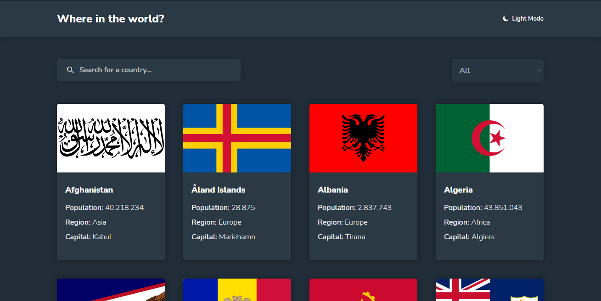
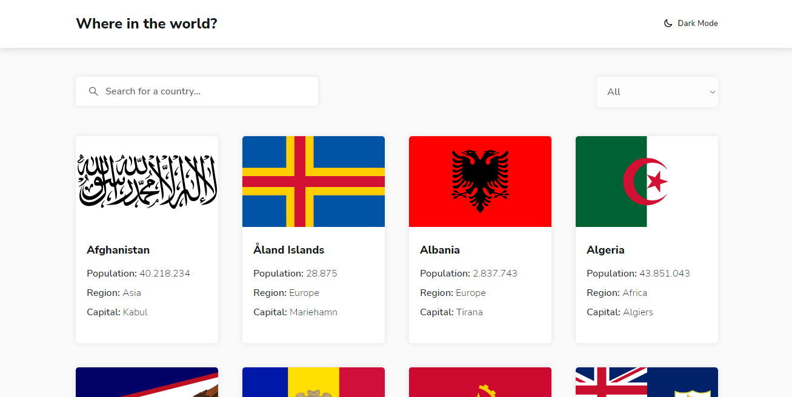

# Rest-Countries-Api

<div style="display: inline_block; width: 100%" align="center">
    <div style="display: inline_block; margin: 20px" align="center">
        
        
    </div>
    <div style="display: inline_block; margin: 20px" align="center">
        
        
    </div>
    <div style="display: inline_block" align="center">
        
        
        
        
    </div>
</div>

> O projeto consiste em listar todos os paises do mundo, filtra-los pelo nome e região, mostrar as informações de um pais e, além disso, poder escolher o tema do site entre escuro e claro.

## Técnologias utilizadas

- ReactJS
  - useState
  - useEffect
  - react-router-dom
- JavaScript
- CSS3

## Futuras implementaçõs

- ContextApi
- TypeScript
- Styled-components

## 💻 Pré-requisitos

Antes de começar, verifique se você atendeu aos seguintes requisitos:

<!---Estes são apenas requisitos de exemplo. Adicionar, duplicar ou remover conforme necessário--->

- Você instalou a versão mais recente do `Node` em sua máquina.

## 🚀 Instalando Rest-Countries-Api

Para instalar o projeto, siga estas etapas:

- Crie uma pasta chamada CountriesApi
- Faça um clone desse repositório na pasta criada

```
git clone https://github.com/MthAbreu/Rest-Countries-Api.git
```

- Por último, instale todas as dependencias

```
npm install

//ou

yarn install
```

## ☕ Usando Rest-Countries-Api

Para usar o projeto, siga estas etapas:

- Iniciando o servidor

```
npm start

//ou

yarn start
```

## 📫 Contribuindo para Rest-Countries-Api

<!---Se o seu README for longo ou se você tiver algum processo ou etapas específicas que deseja que os contribuidores sigam, considere a criação de um arquivo CONTRIBUTING.md separado--->

Para contribuir com o projeto, siga estas etapas:

1. Bifurque este repositório.
2. Crie um branch: `git checkout -b <nome_branch>`.
3. Faça suas alterações e confirme-as: `git commit -m '<mensagem_commit>'`
4. Envie para o branch original: `git push origin <nome_do_projeto> / <local>`
5. Crie a solicitação de pull.

Como alternativa, consulte a documentação do GitHub em [como criar uma solicitação pull](https://help.github.com/en/github/collaborating-with-issues-and-pull-requests/creating-a-pull-request).

[⬆ Voltar ao topo](#Rest-Countries-Api)<br>
